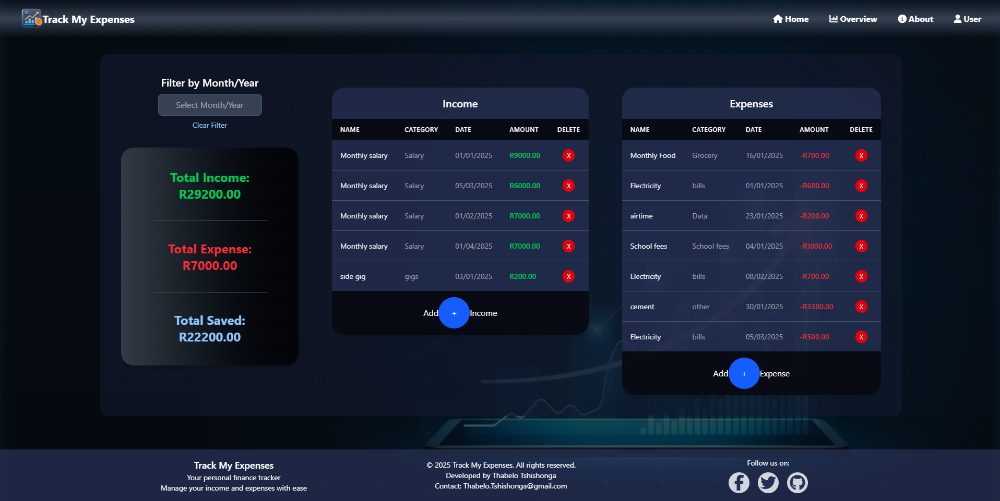

# Track My Expenses 💰 [](https://react.dev/) [](https://tailwindcss.com/) [](https://opensource.org/licenses/MIT)

A comprehensive financial tracking application with advanced visualization features, built with React and Tailwind CSS.

 
---

## Features ✨

-   **Dual Tracking**: Separate management for income and expenses.
-   **Data Persistence**: Local storage integration for session continuity.
-   **Financial Insights**: Interactive charts and graphs (Doughnut, Bar).
-   **Advanced Filtering**: Date-range filtering with month/year picker.
-   **Responsive UI**: Mobile-first design implemented with Tailwind CSS.
-   **Transaction Management**:
    -   Add/remove transactions with categories.
    -   Automatic total calculations.
-   **Dark Mode**: Built-in dark theme support for comfortable viewing.

---

## Installation 🛠️

1.  **Clone the repository:**
    ```bash
    git clone [https://github.com/yourusername/finance-app.git](https://github.com/yourusername/finance-app.git)
    cd finance-app
    ```

2.  **Install dependencies:**
    ```bash
    npm install
    ```

3.  **Start the development server:**
    ```bash
    npm run dev
    ```
    The application should now be running on your local development server (usually `http://localhost:5173` or similar).

4.  **Build for production:**
    ```bash
    npm run build
    ```
    This command bundles the application for deployment.

---

## Usage 📖

**Adding Transactions:**

1.  Click the `+ Income` or `+ Expense` button.
2.  Fill in the form fields:
    * **Name:** A description of the transaction (e.g., "Groceries", "Salary").
    * **Amount:** The numerical value (e.g., `250.00`).
    * **Category:** Select or create a relevant category (e.g., "Food", "Utilities", "Income").
    * **Date:** Choose the date using the calendar picker or enter it manually.
3.  Click the "Add +" button to save the transaction.

**Key Interactions:**

-   **Filter Transactions:** Use the date range picker located in the sidebar to filter transactions by specific months or years.
-   **Delete Transactions:** Click the red "X" button next to any transaction entry in the list to remove it.
-   **View Insights:** Navigate to the "Overview" section to see visual reports and charts summarizing your financial data.

---

## Component Structure 🧩

```text
src/
├── components/
│   ├── AddExpenseForm.jsx
│   ├── AddIncomeForm.jsx
│   ├── DateSelector.jsx
│   ├── ExpenseList.jsx
│   ├── IncomeList.jsx
│   ├── TotalAmount.jsx
│   ├── Overview.jsx       # Contains chart components
│   ├── Navbar.jsx
│   └── Footer.jsx
├── App.jsx                # Main application component with routing
├── main.jsx               # Entry point of the React application
└── index.css          # Global styles and Tailwind imports
````
---
## Technologies ⚙️
-  Frontend: React 18+, React Router 6
-  Styling: Tailwind CSS 4.1
-  Visualization: Chart.js 4.4+, react-chartjs-2, react-datepicker
-  State Management: React Hooks (useState, useEffect, useContext)
-  Build Tool: Vite 4+
-  Persistence: Browser Local Storage
---
## Acknowledgements 🙏
-  React Icons
-  Chart.js & react-chartjs-2
-  Tailwind CSS community
-  Google Search (AI Financial Advisor 🤖)
---
## Contact 📧
Thabelo Tshishonga

-  📧 Email: Thabelo.Tshishonga@gmail.com
-  🐦 Twitter: @Thabelo_SA
---
